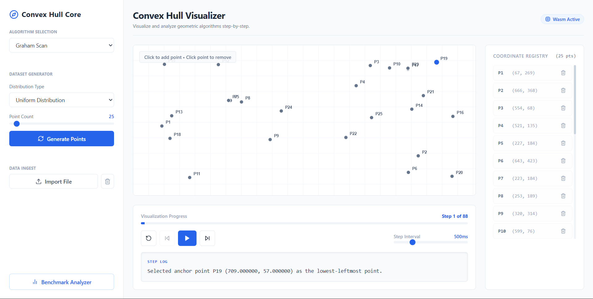
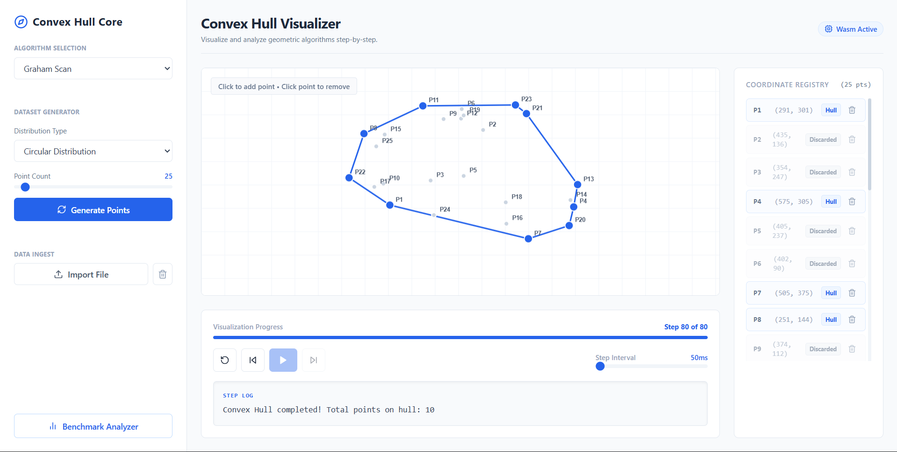

# 🛡️ The Great Wrap: Step-by-Step Geometric Convex Hull Visualizer
Tugas Seleksi Asisten Laboratorium IRK 2026.
Visualizer interaktif berbasis web untuk mengeksplorasi pembentukan Convex Hull secara step-by-step dengan performa tinggi menggunakan C++ WebAssembly core dan React sebagai basis frontend.

## 🚀 Fitur Utama & Checklist Penilaian
Berikut adalah checklist status pengerjaan fitur berdasarkan tabel penilaian resmi pada `task.md`:
| Tipe | Aspek | Nilai Maksimum | Status |
| :--- | :--- | :---: | :---: |
| **Spesifikasi Wajib** | Input Dataset | 150 | `[x] Selesai` |
| | GUI & Visualisasi | 350 | `[x] Selesai` |
| | Graham Scan | 350 | `[x] Selesai` |
| | Jarvis March | 350 | `[x] Selesai` |
| | Dokumentasi | 300 | `[x] Selesai` |
| **Spesifikasi Bonus** | Visualisasi Step-by-Step | 400 | `[x] Selesai` |
| | QuickHull | 500 | `[x] Selesai` |
| | Benchmark Algoritma | 300 | `[x] Selesai` |
| | Dynamic Convex Hull | 300 | `[x] Selesai` |
| | Dataset Generator | 100 | `[x] Selesai` |
| | Edge Case Handling | 200 | `[x] Selesai` |
| **Demonstrasi** | Demo Video | 500 | `[x] Selesai` |
| **Total** | | **3800** | **100% Pengerjaan** |
1. **Pilihan 3 Algoritma Convex Hull**:
   - **Graham Scan** ($O(N \log N)$)
   - **Jarvis March / Gift Wrapping** ($O(N \cdot H)$)
   - **QuickHull** ($O(N \log N)$ rata-rata, $O(N^2)$ terburuk)
2. **Visualisasi Interaktif Step-by-Step**:
   - Kontrol pemutaran visualisasi, _Play, Pause, Next Step, Previous Step, dan Reset_.
   - Slider kecepatan step interval (50ms hingga 2000ms).
   - Log _step-by-step_ C++ _real-time_ (arah putaran searah/berlawanan jarum jam, _push/pop stack_, pemilihan _pivot_, partisi wilayah, dll).
3. **Dataset Generator Khusus**:
   - 5 tipe distribusi titik: **Uniform, Circular, Rectangular, Normal Gaussian, dan Clustered Gaussian**.
   - Slider jumlah generator titik (3 hingga 500 titik).
4. **Ingest & Manipulasi Data Fleksibel**:
   - Klik langsung pada Grid Canvas untuk menambahkan/menghapus koordinat secara _real-time_.
   - Panel Registry data koordinat lengkap dengan status titik (Hull, Active, Discarded).
   - Tombol sekali klik untuk membersihkan canvas (*Clear Canvas*).
   - Fitur **Import Dataset** dari berkas `.txt` (pemisah spasi) dan `.csv` (pemisah koma). Baris komentar diawali `#` diabaikan.
5. **Benchmark Analyzer**:
   - Pengujian run-time mikrodetik langsung di browser pada input berukuran $N = 10, 50, 100, 500, 1000$ points.
   - Visualisasi perbandingan kecepatan relatif dalam bentuk grafik batang (bar chart) dan tabel performa.
6. **Edge Case Handling**:
   - Deduplikasi otomatis terhadap titik koordinat duplikat dengan log visual.
   - Penanganan titik kolinear (sejajar segaris) pada semua algoritma dengan membuang titik tengah dan mempertahankan titik ujung terjauh.
   - Banner notifikasi peringatan bila titik kurang dari 3.
## 🛠️ Teknologi & Framework
- **Core Algorithms**: C++20 standard library
- **WebAssembly Compiler**: Emscripten (`emcc` / `bind.h`)
- **Frontend Stack**: Next.js 14 (React 18), TypeScript, TailwindCSS
- **Icons**: Lucide React
## 💡 Penjelasan Convex Hull & Algoritma
### Convex Hull
Convex Hull dari sekumpulan titik $S$ adalah poligon cembung terkecil yang melingkupi seluruh titik di $S$.
### 1. Graham Scan
- **Cara Kerja**:
  1. Pilih titik anchor dengan koordinat Y terendah (dan X terkiri jika Y sama).
  2. Urutkan seluruh titik lainnya berdasarkan sudut polar relatif terhadap anchor.
  3. Iterasi setiap titik hasil urutan: masukkan ke stack, lalu periksa 3 titik teratas stack ($P_1, P_2, P_3$).
  4. Jika arah putaran $P_1 \to P_2 \to P_3$ adalah searah jarum jam (clockwise/right turn), keluarkan $P_2$ dari stack. Ulangi hingga didapat putaran berlawanan arah jarum jam (counter-clockwise/left turn).
- **Kompleksitas**:
  - **Waktu**: $O(N \log N)$ untuk pengurutan sudut polar. Proses scanning stack membutuhkan $O(N)$ karena setiap titik di-push dan di-pop maksimal sekali.
  - **Ruang**: $O(N)$ untuk menyimpan titik terurut dan stack.
### 2. Jarvis March (Gift Wrapping)
- **Cara Kerja**:
  1. Mulai dari titik paling kiri (pasti merupakan bagian dari Convex Hull).
  2. Cari titik berikutnya $P_{next}$ dengan membandingkan sudut polar dari titik aktif saat ini terhadap seluruh kandidat titik lainnya.
  3. Titik berikutnya dipilih yang memiliki orientasi paling "kanan" (counter-clockwise paling luar). Jika ditemui titik kolinear, titik terjauh dipilih.
  4. Jadikan $P_{next}$ sebagai titik aktif baru. Ulangi proses hingga kembali ke titik awal.
- **Kompleksitas**:
  - **Waktu**: $O(N \cdot H)$ dengan $H$ adalah jumlah titik pada Convex Hull akhir. Kasus terburuk $O(N^2)$ jika semua titik berada pada Convex Hull (misal tersusun melingkar).
  - **Ruang**: $O(N)$ untuk representasi data koordinat.
### 3. QuickHull
- **Cara Kerja**:
  1. Temukan titik terkiri $A$ dan terkanan $B$ untuk membentuk garis dasar awal yang membagi himpunan titik menjadi dua bagian (kiri dan kanan).
  2. Cari titik $C$ dengan jarak tegak lurus terjauh dari garis $AB$. Titik $C$ terbukti menjadi titik Convex Hull.
  3. Bentuk segitiga $ACB$. Titik-titik di dalam segitiga dibuang karena tidak mungkin menjadi hull.
  4. Secara rekursif lakukan pencarian untuk wilayah di luar segmen $AC$ (kiri) dan $CB$ (kanan).
- **Kompleksitas**:
  - **Waktu**: $O(N \log N)$ rata-rata karena pembagian wilayah yang seimbang. Kasus terburuk $O(N^2)$ jika pembagian wilayah tidak seimbang (titik melengkung bias).
  - **Ruang**: $O(N)$ untuk stack rekursi terdalam.
## 📸 Screenshot Hasil Convex Hull

## 💻 Cara Menjalankan Program
### Prasyarat
- Node.js (v18 ke atas) & npm
- GCC/Clang Compiler & Emscripten SDK
### Langkah Instalasi
1. Clone repositori ini:
   ```bash
   git clone <repo-url>
   cd step-by-step-geometric-convex-hull-visualizer
   ```
2. Instal dependensi node modules:
   ```bash
   npm install
   ```
3. Jalankan server pengembangan lokal:
   ```bash
   npm run dev
   ```
4. Buka browser di [http://localhost:3000](http://localhost:3000).
### Kompilasi C++ Core
Bila ingin melakukan perubahan pada C++ di dalam `algorithm-core/src/`:
```bash
cd algorithm-core
make
```
Ini akan membangun ulang berkas `public/algorithm_core.js` dan `public/algorithm_core.wasm`.
## 📚 Referensi
- [CP-Algorithms - Convex Hull construction](https://cp-algorithms.com/geometry/convex-hull.html)
- [GeeksforGeeks - QuickHull Algorithm](https://www.geeksforgeeks.org/dsa/quickhull-algorithm-convex-hull/)
- [GeeksforGeeks (Terjemahan) - Convex Hull using Jarvis's Algorithm or Wrapping](https://www-geeksforgeeks-org.translate.goog/dsa/convex-hull-using-jarvis-algorithm-or-wrapping/?_x_tr_sl=en&_x_tr_tl=id&_x_tr_hl=id&_x_tr_pto=tc&_x_tr_hist=true)
- [USACO Guide - Convex Hull](https://usaco.guide/plat/convex-hull)
- Wikipedia contributors. (2026). *Convex Hull Algorithms (Graham Scan, Jarvis March, QuickHull)*. Wikipedia, The Free Encyclopedia.
- Cormen, T. H., Leiserson, C. E., Rivest, R. L., & Stein, C. (2025). *Introduction to Algorithms* (CLRS). MIT Press.